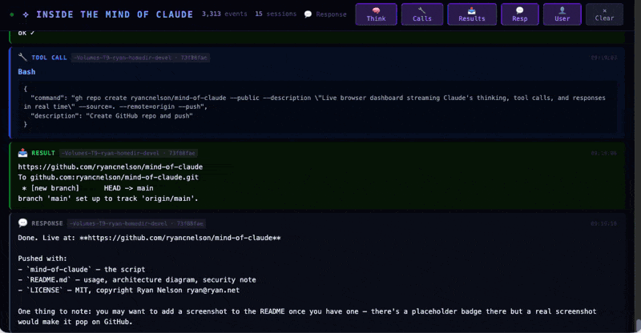

# Inside the Mind of Claude

A live browser dashboard that streams Claude's internal activity in real time —
thinking blocks, tool calls, tool results, and responses — by watching the
JSONL session files that Claude Code writes to `~/.claude/projects/`.

 



## What it looks like

The dashboard shows a live feed of cards, color-coded by event type:

| Color | Event |
|-------|-------|
| 🟣 Purple | `🧠 Thinking` — Claude's extended reasoning |
| 🔵 Blue | `🔧 Tool Call` — tool invocations with JSON input |
| 🟢 Green | `📤 Result` — tool results (red if errored) |
| ⬜ Gray | `💬 Response` — Claude's text output |
| ⬛ Dark | `👤 User` — your messages |

Each card shows the project name, session ID, and timestamp. Long cards can be
expanded inline. Filter buttons let you hide/show each event type. Auto-scroll
follows new events; a jump-to-bottom button appears when you scroll up.

## Requirements

- Python 3.8+
- Claude Code (`claude` CLI) — this reads the JSONL files it writes
- A modern browser

No external dependencies. Pure stdlib.

## Installation

```bash
# Download the script
curl -O https://raw.githubusercontent.com/ryancnelson/mind-of-claude/main/mind-of-claude
chmod +x mind-of-claude

# Or clone the repo
git clone https://github.com/ryancnelson/mind-of-claude.git
cd mind-of-claude
chmod +x mind-of-claude
```

Optionally put it on your PATH:

```bash
cp mind-of-claude ~/bin/mind-of-claude
```

## Usage

```bash
mind-of-claude              # serves on http://127.0.0.1:7777
mind-of-claude 8888         # custom port
mind-of-claude 8888 0.0.0.0 # listen on all interfaces (LAN access)
```

The browser opens automatically. Start a Claude Code session in another
terminal and watch the activity stream in.

On startup it replays any session files modified in the last 6 hours, so you
get context from recent work immediately.

## How it works

Claude Code appends newline-delimited JSON to `~/.claude/projects/**/*.jsonl`
as it runs. Each line is a conversation turn — user messages, assistant
responses with thinking blocks and tool calls, and tool results.

`mind-of-claude` runs a background thread that polls those files every 0.5
seconds for new bytes. New entries are parsed and broadcast to all connected
browsers via **Server-Sent Events**. Late-joining clients receive a replay of
the last 1000 events from an in-memory buffer.

```
~/.claude/projects/**/*.jsonl
         │
         │  (poll every 0.5s)
         ▼
    watcher thread
         │
         │  parse JSONL entries
         ▼
    broadcast() → SSE → browser
```

## Security note

The server binds to `127.0.0.1` by default. Do not expose it to untrusted
networks — the JSONL files contain your full conversation history including
any sensitive context you've shared with Claude.

## License

MIT — Copyright (c) 2026 Ryan Nelson <ryan@ryan.net>
